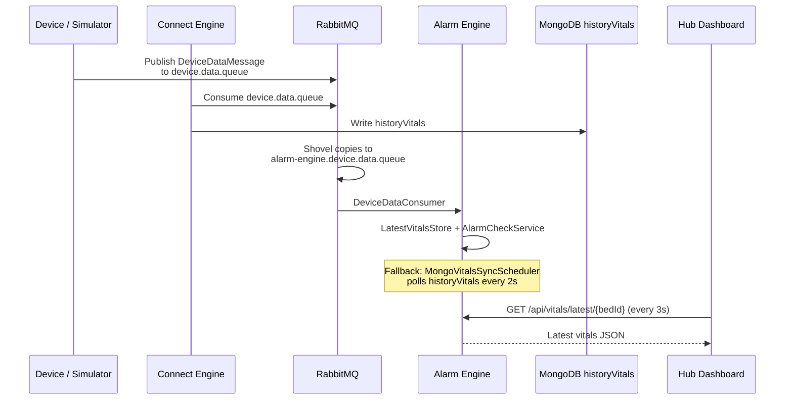
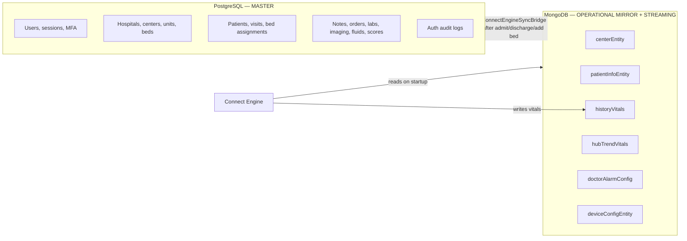
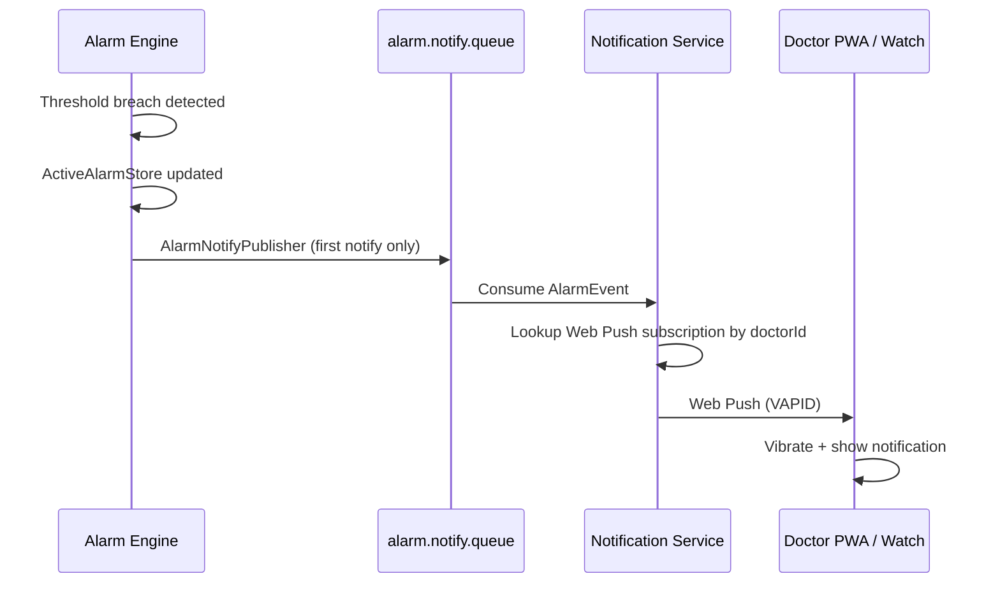
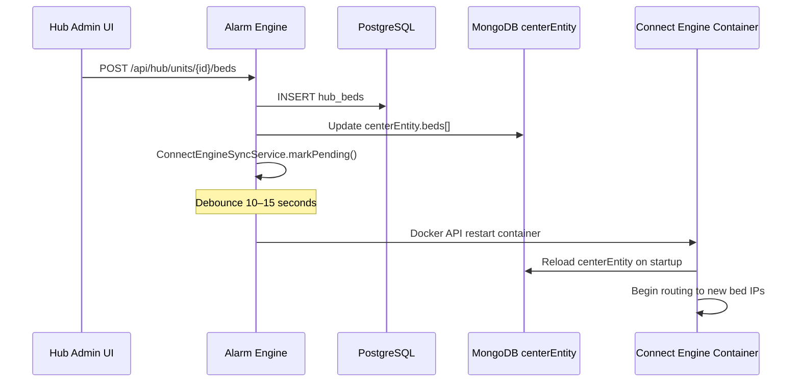
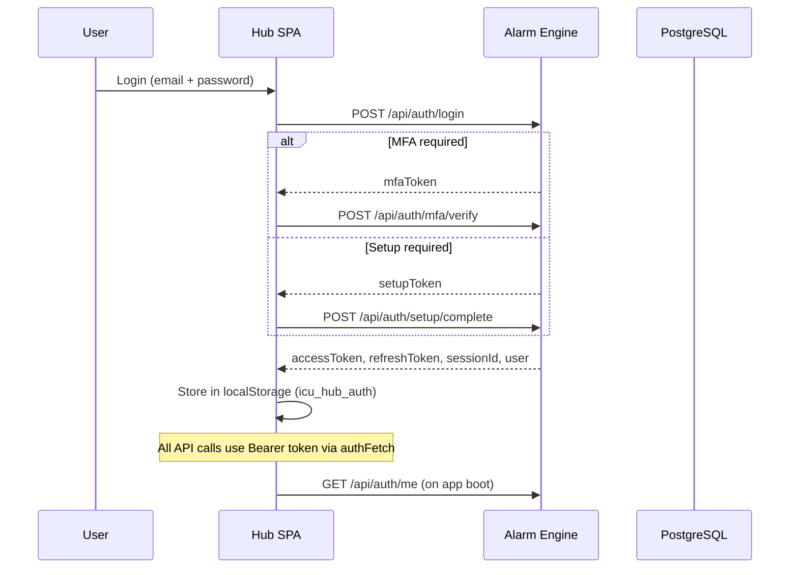

# ICU Connect V2 — Architecture & Developer Handover

**Project:** RTWO ICU Connect Hub + Alarm Engine POC  
**Version:** V2 (center `RTWO` / location `JPN`)  
**Last updated:** July 2026  
**Audience:** Developers taking over maintenance and new feature work

---

## Table of Contents

1. [Executive Summary](#1-executive-summary)
2. [System Architecture](#2-system-architecture)
3. [Services & Ports](#3-services--ports)
4. [Repository Layout](#4-repository-layout)
5. [Data Architecture: PostgreSQL vs MongoDB](#5-data-architecture-postgresql-vs-mongodb)
6. [RabbitMQ — Queues, Shovels, Data Flow](#6-rabbitmq--queues-shovels-data-flow)
7. [Connect Engine — How It Works](#7-connect-engine--how-it-works)
8. [Alarm Engine — Vitals & Alarm Pipeline](#8-alarm-engine--vitals--alarm-pipeline)
9. [ICU Connect Hub (Frontend SPA)](#9-icu-connect-hub-frontend-spa)
10. [Complete API Reference](#10-complete-api-reference)
11. [Authentication & Authorization](#11-authentication--authorization)
12. [Notification Service & ICU Watch PWA](#12-notification-service--icu-watch-pwa)
13. [Startup & Operations](#13-startup--operations)
14. [Environment Variables](#14-environment-variables)
15. [Known Limitations & Gotchas](#15-known-limitations--gotchas)
16. [Development Guide](#16-development-guide)

> **Split production deployment** (Connect Engine + RabbitMQ on hospital site, Hub on RTWO cloud) is documented separately in **[LIVE-SPLIT-DEPLOYMENT.md](./LIVE-SPLIT-DEPLOYMENT.md)**.

---

## 1. Executive Summary

This platform is an **ICU clinical operations hub** combined with a **real-time patient monitoring and alarm system**. It serves hospital staff through a React web application and optionally delivers alarm notifications to doctors' phones/watches via Web Push.

### What each major component does

| Component | Role |
|-----------|------|
| **ICU Connect Hub** | React SPA — unit dashboard, bed detail, admissions, clinical notes, scoring, analytics, admin |
| **Alarm Engine** | Spring Boot backend — **single API gateway** for Hub + alarms + auth + clinical data |
| **Connect Engine** | External CIS device gateway (not in this repo) — connects bedside monitors/pumps/ventilators |
| **MongoDB** | Operational CIS store — vitals history, center/bed config, alarm thresholds, patient mirror |
| **PostgreSQL** | Hub master store — users, hospitals, units, beds, patients, visits, clinical documentation |
| **RabbitMQ** | Real-time vitals streaming + alarm notification fan-out |
| **Notification Service** | Node.js — consumes alarm events, sends Web Push to doctor PWA |
| **ICU Watch PWA** | React PWA for mobile/watch alarm notifications |

### Key design principle

**PostgreSQL is the master for Hub clinical and admin data.**  
**MongoDB is the operational mirror for Connect Engine compatibility.**  
After Postgres commits (admit, discharge, add bed), `ConnectEngineSyncBridge` writes CE-compatible documents to Mongo, then triggers a debounced Connect Engine container restart so CE reloads from Mongo.

---

## 2. System Architecture

### 2.1 High-level diagram

```mermaid
flowchart TB
    subgraph Users
        CLIN[Clinical Staff Browser]
        ADMIN[Hospital / Super Admin]
        DOC[Doctor Phone PWA]
    end

    subgraph RTWO_Hub["RTWO Hub Stack (docker-compose.poc.yml)"]
        HUB[ICU Connect Hub SPA<br/>:8000 → nginx :80]
        AE[Alarm Engine<br/>:7020 / internal :9020]
        PG[(PostgreSQL icu_hub<br/>:7001)]
        NS[Notification Service<br/>:7030]
        PWA[ICU Watch PWA<br/>:7031]
    end

    subgraph Shared_Infra["Shared Infra (docker-compose.infra.yml)"]
        MG[(MongoDB v2-ICU-Connect<br/>:7000)]
        RMQ[RabbitMQ<br/>AMQP :7003 / Mgmt :7004]
    end

    subgraph Client_Site["Client Site (CIS-Deployment stack)"]
        CE[Connect Engine<br/>:9010 / nginx :7012]
        DEV[Bedside Devices /<br/>Device Simulator :172.25.0.8]
    end

    CLIN --> HUB
    ADMIN --> HUB
    DOC --> PWA

    HUB -->|"/api/*"| AE
    PWA -->|vitals poll| AE
    PWA -->|push subscribe| NS

    AE --> PG
    AE --> MG
    AE --> RMQ
    AE -->|HTTP /retrieve /update<br/>Docker restart| CE

    DEV -->|vitals AMQP| RMQ
    CE -->|consume device.data.queue| RMQ
    CE -->|write historyVitals| MG
    RMQ -->|shovel copy| AE
    AE -->|alarm.notify.queue| RMQ
    RMQ --> NS
```



### 2.2 Request path (Hub UI → backend)

There is **no separate Hub backend**. The React app calls `/api/*` which is proxied to Alarm Engine:

| Environment | Proxy |
|-------------|-------|
| Local dev | Vite (`vite.config.js`) → `http://localhost:7020` |
| Docker | Hub nginx (`nginx.conf`) → `http://CIS-alarm-engine:9020/api/` |

### 2.3 Vitals path (device → dashboard)



---

## 3. Services & Ports

### 3.1 Hub stack (`~/RTWO-version-2` on QA server)

| Service | Container | Host Port | Internal Port | Description |
|---------|-----------|-----------|---------------|-------------|
| MongoDB | CIS-mongodb | 7000 | 27017 | CIS operational DB |
| PostgreSQL | CIS-postgres | 7001 | 5432 | Hub master DB (`icu_hub`) |
| RabbitMQ AMQP | CIS-rabbitmq | 7003 | 5672 | Message broker |
| RabbitMQ Mgmt | CIS-rabbitmq | 7004 | 15672 | Shovel admin UI |
| Alarm Engine | CIS-alarm-engine | 7020 | 9020 | All `/api/*` |
| Notification Service | CIS-notification-service | 7030 | 9030 | Web Push |
| ICU Watch PWA | CIS-icu-watch-pwa | 7031 | 80 | Doctor mobile app |
| ICU Connect Hub | CIS-icu-connect-hub | **8000** | 80 | Main web UI |

### 3.2 CIS / Connect Engine stack (`~/CIS-Deployment` on QA server)

| Service | Container | Host Port | Description |
|---------|-----------|-----------|-------------|
| Connect Engine | CIS-Deployment-connect-engine | 9010 (direct) / 7012 (nginx) | Device gateway |
| Device Simulator | CIS-Deployment-device-simulation-bed1 | — (IP 172.25.0.8) | Demo vitals |
| CIS Backend | varies | 7014 | Legacy vitals REST (PWA) |
| CIS Frontend nginx | varies | 7011 | Legacy CIS UI |

### 3.3 Docker networks

| Network | Subnet | Services |
|---------|--------|----------|
| `alarampoc_docker_compose_network` | 172.31.0.0/16 | Hub stack + Mongo + Rabbit + Postgres |
| `cis-deployment_docker_compose_network` | 172.25.0.0/16 | Connect Engine + device simulator |

Connect Engine joins **both** networks on the server so Alarm Engine can reach it at `http://connectengine:9010` or `http://172.25.0.3:9010`.

### 3.4 Static IPs (POC network)

| IP | Service |
|----|---------|
| 172.31.0.10 | alarm-engine |
| 172.31.0.11 | notification-service |
| 172.31.0.12 | icu-watch-pwa |
| 172.31.0.15 | icu-connect-hub |
| 172.31.0.20 | CIS-mongodb |
| 172.31.0.21 | CIS-rabbitmq |
| 172.31.0.22 | CIS-postgres |
| 172.25.0.3 | connectengine |
| 172.25.0.8 | device simulator |

---

## 4. Repository Layout

```
alaram poc/                          # Root — Docker orchestration
├── docker-compose.infra.yml         # MongoDB, RabbitMQ, Postgres
├── docker-compose.poc.yml           # Hub stack (alarm-engine, hub, PWA, notifications)
├── docker-compose.yml               # Slim alarm-only stack
├── .env.example                     # Environment template
└── CIS-Deployment/
    ├── alarmEngine/                 # Spring Boot — ALL backend APIs
    │   ├── src/main/java/...        # Controllers, services, consumers
    │   └── src/main/resources/
    │       ├── application.properties
    │       └── db/migration/        # Flyway PostgreSQL migrations (V1–V19)
    ├── icuConnectHub/               # React SPA — main web UI
    │   └── src/api/                 # Frontend API client modules
    ├── notificationService/         # Node.js Web Push service
    ├── icuWatchPwa/                 # Doctor mobile PWA
    ├── scripts/                     # Start, deploy, shovel setup scripts
    └── docs/                        # This documentation
```

**Not in this repo (external):**
- `connectEngine/` source — JAR-only, deployed via separate `CIS-Deployment` git repo
- Full `CIS-Deployment/docker-compose.yml` — Connect Engine + visualization + nginx

---

## 5. Data Architecture: PostgreSQL vs MongoDB

### 5.1 Responsibility split



### 5.2 PostgreSQL (`icu_hub`) — what is stored

Database: `icu_hub` on port **7001**  
Migrations: `alarmEngine/src/main/resources/db/migration/V1__hub_schema.sql` through `V19__*.sql`

| Table group | Tables | Purpose |
|-------------|--------|---------|
| **Auth & RBAC** | `hub_users`, `hub_auth_sessions`, `hub_mfa_challenges`, `hub_password_reset_tokens`, `hub_auth_audit`, `hub_hospitals`, `hub_roles`, `hub_role_permissions`, `hub_user_roles` | Login, MFA, password reset, super-admin hospitals, hospital-admin users/roles |
| **Facility** | `hub_centers`, `hub_units`, `hub_beds` | ICU center (RTWO), units (ICU-1, ICU-2), bed labels, device IPs |
| **Patients** | `hub_patients`, `hub_patient_visits`, `hub_bed_assignments`, `hub_admission_drafts` | MRN, demographics, active visits, bed occupancy |
| **Clinical** | `hub_clinical_notes`, `hub_orders`, `hub_lab_results`, `hub_imaging_studies`, `hub_fluid_entries`, `hub_score_snapshots` | Progress notes, orders, labs, imaging, fluid balance, APACHE/SOFA scores |
| **Sync audit** | `hub_mongo_sync_log` | Tracks Postgres→Mongo sync success/failure |

**When PostgreSQL is read:**
- All Hub admin pages (units, beds, users, hospitals)
- Admissions workflow (search patients, admit, discharge)
- Bed detail clinical panels (notes, orders, labs, fluids, scoring)
- Reports and analytics (patient lists, operational KPIs)
- Auth on every protected API call
- Overview dashboard merges PG bed layout with live alarm state

**When PostgreSQL is written:**
- User creates unit/bed in Admin UI
- Clinician admits or discharges patient
- Clinical documentation (notes, orders, labs)
- Super-admin creates hospital / hospital-admin
- Alarm threshold save does **not** go to Postgres (goes to Mongo)

### 5.3 MongoDB (`v2-ICU-Connect`) — what is stored

Database: `v2-ICU-Connect` on port **7000**

| Collection | Written by | Read by | Contents |
|------------|-----------|---------|----------|
| `centerEntity` | Alarm Engine (sync bridge), Connect Engine | Alarm Engine, Connect Engine | Center `RTWO` with embedded `beds[]`: label, encrypted device IP, device list, embedded patient |
| `patientInfoEntity` | Alarm Engine (sync bridge) | Alarm Engine, Connect Engine | Patient demographics keyed by UPID (Mongo ObjectId string) |
| `patientInfo` | Legacy | Alarm Engine (fallback read) | Older patient document format |
| `historyVitals` | **Connect Engine** | Alarm Engine (`VitalsReadService`, `MongoVitalsSyncScheduler`) | Time-series vitals per bed: `primaryAttributes`, `secondaryAttributes`, timestamp |
| `hubTrendVitals` | Alarm Engine (`VitalsArchiveService`) | Alarm Engine (`VitalsHistoryController`) | Archived trend snapshots (~5 min intervals) for charts/reports |
| `doctorAlarmConfig` | Alarm Engine | Alarm Engine (`AlarmConfigCacheService`) | Per-doctor, per-bed alarm thresholds (SpO2, HR, Temp, etc.) |
| `deviceConfigEntity` | Manual import / seed | Alarm Engine (`DeviceCatalogService`) | Device simulator catalog: device names, types, attribute schemas |

**When MongoDB is read:**
- `GET /api/center` — bed list with device status
- `GET /api/vitals/latest/{bedId}` — priority: in-memory Rabbit cache → `historyVitals` → virtual simulation
- `GET /api/vitals/history/{bedId}` — `hubTrendVitals` collection
- `GET /api/patients/bed/{bedId}` — patient on bed from `centerEntity`
- `GET/POST /api/alarm-config` — threshold configuration
- `GET /api/devices` — device catalog
- Alarm evaluation — `doctorAlarmConfig` thresholds
- Connect Engine startup — loads all beds from `centerEntity`

**When MongoDB is written:**
- Hub admit/discharge → `ConnectEngineSyncBridge` updates `centerEntity` + `patientInfoEntity`
- Hub add bed → updates `centerEntity.beds[]`
- Connect Engine → continuous `historyVitals` inserts
- Alarm Engine → `hubTrendVitals` archive, `doctorAlarmConfig` on threshold save
- **Never** written by Hub SPA directly — always through Alarm Engine

### 5.4 In-memory stores (Alarm Engine — not persisted)

| Store | Purpose | Retention |
|-------|---------|-----------|
| `LatestVitalsStore` | Fast latest vitals per bed from RabbitMQ | Until replaced |
| `ActiveAlarmStore` | Current active alarms | 30 min / max 200 |
| `VitalTrendBufferService` | Short trend buffer | Minutes |
| `AlarmAcknowledgmentService` | Ack state per alarm | Session |
| `AlarmConfigCacheService` | Cached Mongo thresholds | 30 seconds |

---

## 6. RabbitMQ — Queues, Shovels, Data Flow

### 6.1 Connection details

| Setting | Value |
|---------|-------|
| Host | `CIS-rabbitmq` (Docker) / `localhost:7003` (host) |
| VHost | `ICUcharting` |
| Username | `ICUcharting` |
| Password | `admin@123` |
| Management UI | http://host:7004 |

### 6.2 Queues

| Queue | Producer | Consumer | Message content |
|-------|----------|----------|-----------------|
| `device.data.queue` | Device simulator, bedside devices (via CE) | **Connect Engine** | `DeviceDataMessage` JSON — bedId, primaryAttributes (HR, SpO2…), secondaryAttributes |
| `alarm-engine.device.data.queue` | RabbitMQ **shovel** (copy from above) | **Alarm Engine** `DeviceDataConsumer` | Same vitals message |
| `alarm.notify.queue` | **Alarm Engine** `AlarmNotifyPublisher` | **Notification Service** | `AlarmEvent` JSON — bed, param, value, severity, patient name |

### 6.3 Shovel (critical integration point)

Connect Engine owns `device.data.queue`. Alarm Engine cannot modify CE source code. A **RabbitMQ shovel** copies every message:

```
device.data.queue  ──shovel──►  alarm-engine.device.data.queue
```

Setup options:
- `CIS-Deployment/scripts/setup-rabbitmq-shovel.ps1` (recommended)
- `rabbitmq-setup` one-shot container in `docker-compose.poc.yml`
- Manual via Management UI (port 7004)

Secondary binding (in shovel script):
```
nicu-device-exchange  --[routing key: nicu-connect-device-data]-->  alarm-engine.device.data.queue
```

### 6.4 What RabbitMQ does NOT store

RabbitMQ is a **message broker only** — it does not persist clinical data long-term. Vitals land in:
1. Alarm Engine in-memory cache (immediate)
2. MongoDB `historyVitals` (via Connect Engine)
3. MongoDB `hubTrendVitals` (via Alarm Engine archive)

### 6.5 Alarm notification flow



---

## 7. Connect Engine — How It Works

### 7.1 What Connect Engine is

Connect Engine is an **external Spring Boot application** (RTWO CIS stack) that acts as the **bedside device gateway**. It is **not built from this repository** — it runs from a separate `CIS-Deployment` deployment (GitHub: `Connectengine-DEMO`).

### 7.2 Responsibilities

1. **Device connectivity** — connects to monitors, infusion pumps, ventilators at each bed's IP address on the hospital LAN / Docker network
2. **Vitals ingestion** — receives device data, publishes to `device.data.queue`, writes `historyVitals` to MongoDB
3. **Center configuration** — loads bed layout from MongoDB `centerEntity` on startup
4. **Patient binding** — reads embedded patient info from `centerEntity.beds[].patient`

### 7.3 REST API (called by Alarm Engine only)

| Method | Path | Purpose |
|--------|------|---------|
| GET | `/retrieve` | Live snapshot of center + all beds + device status |
| POST | `/update` | Push center/bed configuration (returns **403** in current deployment — not used) |

Alarm Engine client: `ConnectEngineClient.java`

### 7.4 Sync pattern (Hub changes → Connect Engine)

Because `/update` returns 403, the integration uses **MongoDB + Docker restart**:



**Schedulers involved:**
- `ConnectEngineBedSyncScheduler` — every 30s compares Mongo bed labels vs CE `/retrieve`; triggers restart on drift
- `ConnectEngineReloader` — executes Docker container restart via mounted `/var/run/docker.sock`

**Manual triggers (Hub Admin page):**
- `POST /api/center/reload` — force CE restart
- `POST /api/center/sync-metadata` — pull center name/location from CE into Hub

### 7.5 Device IP addressing

- **Live demo simulator:** fixed IP `172.25.0.8` on `cis-deployment_docker_compose_network`
- Bed records store **encrypted** device IPs in MongoDB
- Only **one bed** can use `172.25.0.8` for live vitals at a time
- Other beds without live devices get **virtual simulated vitals** from `BedVirtualVitalsService`

### 7.6 Device catalog (`deviceConfigEntity`)

Imported from `ICU Charting Dump/deviceConfigEntity.json`. Defines:
- `BplUltimaPrime` — patient monitor
- `BplElisa600` — ventilator
- `Agilia` — infusion pump

Connect Engine uses this to parse device protocol messages.

---

## 8. Alarm Engine — Vitals & Alarm Pipeline

### 8.1 Vitals read priority (`VitalsReadService`)

When Hub calls `GET /api/vitals/latest/{bedId}`:

1. **In-memory** `LatestVitalsStore` (from RabbitMQ, freshest)
2. **MongoDB** `historyVitals` (written by Connect Engine)
3. **Virtual simulation** `BedVirtualVitalsService` (for beds without live devices)
4. Empty response with `source: none`

Response includes `source` field: `cis-live`, `mongo`, `virtual`, `none`

### 8.2 Alarm evaluation (`AlarmCheckService`)

Triggered by:
- **Path A:** `DeviceDataConsumer` on each RabbitMQ message (primary)
- **Path B:** `MongoVitalsSyncScheduler` every 2 seconds (fallback)
- **Path C:** `DemoVitalsPublisher` if `alarm.demo-vitals.enabled=true` (dev only)

Steps:
1. Load thresholds from Mongo `doctorAlarmConfig` (30s cache)
2. Extract vitals: HeartRate/Pulse/HR, SpO2, Temp1, Resp.Rate, PEEP, MV, Peak, VT
3. Compare against high/low thresholds per enabled parameter
4. On breach: create `AlarmEvent`, assign severity (WARNING / CRITICAL)
5. Store in `ActiveAlarmStore` (in-memory)
6. Publish to `alarm.notify.queue` only on **first** notification per bed/param
7. Acknowledgment suppresses re-notify until vitals normalize

### 8.3 Alarm threshold configuration

- Stored in MongoDB `doctorAlarmConfig`
- Keyed by `doctorId` + `bedId` + `paramName`
- Hub UI: `AlarmThresholdPanel` on bed detail page
- Default doctor ID for POC: `doctor-001` (set in `AuthContext.jsx` localStorage)
- **Important:** bedId must match exactly (e.g. `ICU-1-BED 1` not `ICU-1-BED-01`)

---

## 9. ICU Connect Hub (Frontend SPA)

### 9.1 Tech stack

- React 18 + Vite
- React Router for navigation
- No global state library — Context API (`AuthContext`)
- CSS modules / plain CSS
- Polls APIs every 3 seconds on dashboard

### 9.2 Role-based routing

| Role | Home route | Key pages |
|------|------------|-----------|
| Super Admin | `/` | Hospitals, centers-admins, platform analytics, audit |
| Hospital Admin | `/admin` | Units/beds, users, roles, analytics, alarms |
| Clinical Staff | `/unit` | Unit dashboard, bed detail, patients, alarms, reports, scoring |

### 9.3 Main pages and API usage

| Page | Route | Key APIs (polling) |
|------|-------|-------------------|
| Unit Dashboard | `/unit` | `/api/center`, `/api/alarm/active`, `/api/hub/units`, `/api/vitals/latest/{bedId}` every 3s |
| Bed Detail | `/bed/:bedId` | `/api/hub/clinical/context`, vitals, history, alarms, clinical CRUD |
| Patient Management | `/patients` | `/api/hub/admissions/*` |
| Alarm Center | `/alarms` | `/api/alarm/feed`, acknowledge |
| Admin | `/admin` | units/beds CRUD, `/api/center/reload`, `/api/center/sync-metadata` |
| Analytics | `/analytics` | `/api/hub/analytics/center` |
| Universal Dashboard | `/universal` | `/api/hub/overview` |

### 9.4 Frontend API modules

| File | APIs covered |
|------|-------------|
| `src/api/auth.js` | Auth endpoints + `authFetch` wrapper |
| `src/api/hub.js` | Center, vitals, alarms, devices, patients |
| `src/api/units.js` | Hub units and beds |
| `src/api/admissions.js` | Admit, discharge, patient search |
| `src/api/clinical.js` | Notes, orders, labs, imaging, fluids, OCR |
| `src/api/alarmConfig.js` | Threshold save/load |
| `src/api/scoring.js` | APACHE/SOFA scoring |
| `src/api/analytics.js` | Center analytics |
| `src/api/overview.js` | Operational overview |
| `src/api/superAdmin.js` | Platform admin |
| `src/api/hospitalAdmin.js` | Hospital admin |

---

## 10. Complete API Reference

**Base URL:** `http://<host>:7020` (Alarm Engine)  
**Hub UI proxies:** `http://<host>:8000/api/...` → Alarm Engine

### 10.1 Auth — `/api/auth/*`

| Method | Path | Purpose |
|--------|------|---------|
| POST | `/api/auth/login` | Email/password login → tokens or MFA challenge |
| POST | `/api/auth/mfa/verify` | Verify OTP (email or TOTP) |
| POST | `/api/auth/mfa/resend` | Resend MFA code |
| POST | `/api/auth/setup/complete` | First-time account setup |
| POST | `/api/auth/forgot-password` | Request reset email |
| POST | `/api/auth/reset-password` | Complete password reset |
| POST | `/api/auth/refresh` | Refresh access token |
| POST | `/api/auth/logout` | End session |
| GET | `/api/auth/me` | Current user profile |
| POST | `/api/auth/totp/enroll` | Start TOTP enrollment |
| POST | `/api/auth/totp/confirm` | Confirm TOTP enrollment |

### 10.2 Super Admin — `/api/super-admin/*` (requires SUPER_ADMIN role)

| Method | Path | Purpose |
|--------|------|---------|
| GET | `/api/super-admin/platform/overview` | Platform KPIs |
| GET | `/api/super-admin/platform/analytics` | Platform analytics |
| GET | `/api/super-admin/audit-logs` | Platform audit log |
| GET | `/api/super-admin/hospitals` | List hospitals |
| GET | `/api/super-admin/hospitals/{id}` | Hospital detail |
| POST | `/api/super-admin/hospitals` | Create hospital |
| PATCH | `/api/super-admin/hospitals/{id}` | Update hospital |
| DELETE | `/api/super-admin/hospitals/{id}` | Delete hospital |
| POST | `/api/super-admin/hospitals/{id}/centers` | Link ICU center |
| PATCH | `/api/super-admin/hospitals/{id}/centers/{centerId}` | Update center link |
| DELETE | `/api/super-admin/hospitals/{id}/centers/{centerId}` | Unlink center |
| POST | `/api/super-admin/hospitals/{id}/admins` | Create hospital admin |
| PATCH | `/api/super-admin/hospitals/{id}/admins/{userId}` | Update admin |
| POST | `/api/super-admin/hospitals/{id}/admins/{userId}/reset-temp-password` | Reset admin password |
| DELETE | `/api/super-admin/hospitals/{id}/admins/{userId}` | Delete admin |
| GET | `/api/super-admin/centers-admins` | All centers + admins |

### 10.3 Hospital Admin — `/api/hospital-admin/*`

| Method | Path | Purpose |
|--------|------|---------|
| GET | `/api/hospital-admin/centers` | Centers for this hospital |
| GET | `/api/hospital-admin/users` | List users |
| POST | `/api/hospital-admin/users` | Create user |
| PATCH | `/api/hospital-admin/users/{userId}` | Update user |
| GET | `/api/hospital-admin/roles` | List roles |
| POST | `/api/hospital-admin/roles` | Create role |
| PATCH | `/api/hospital-admin/roles/{roleId}` | Update role |
| GET | `/api/hospital-admin/permissions` | Permission catalog |
| GET | `/api/hospital-admin/audit-logs` | Hospital audit log |

### 10.4 Hub Units — `/api/hub/units/*`

| Method | Path | Purpose |
|--------|------|---------|
| GET | `/api/hub/units` | List ICU units |
| GET | `/api/hub/units/{unitId}` | Unit detail + beds |
| POST | `/api/hub/units` | Create unit |
| POST | `/api/hub/units/{unitId}/beds` | Add bed (syncs Mongo + CE restart) |
| GET | `/api/hub/units/{unitId}/beds` | List beds in unit |

### 10.5 Hub Admissions — `/api/hub/admissions/*`

| Method | Path | Purpose |
|--------|------|---------|
| GET | `/api/hub/admissions/patients/search?q=` | Search patients by name/MRN |
| GET | `/api/hub/admissions/beds` | Available beds for admission |
| POST | `/api/hub/admissions/draft` | Save admission draft |
| POST | `/api/hub/admissions/admit` | Admit patient to bed |
| POST | `/api/hub/admissions/readmit` | Re-admit patient |
| GET | `/api/hub/admissions/discharge-preview` | Discharge summary preview |
| POST | `/api/hub/admissions/discharge` | Discharge patient |

### 10.6 Hub Clinical — `/api/hub/clinical/*`

| Method | Path | Purpose |
|--------|------|---------|
| GET | `/api/hub/clinical/context?bedId=` | Bed clinical context (visit, patient) |
| GET | `/api/hub/clinical/visits/{visitId}/history` | Patient history timeline |
| GET | `/api/hub/clinical/visits/{visitId}/notes` | List clinical notes |
| POST | `/api/hub/clinical/visits/{visitId}/notes` | Create note |
| PATCH | `/api/hub/clinical/notes/{noteId}` | Update note |
| GET | `/api/hub/clinical/visits/{visitId}/orders` | List orders |
| POST | `/api/hub/clinical/visits/{visitId}/orders` | Create order |
| PATCH | `/api/hub/clinical/orders/{orderId}` | Update order |
| GET | `/api/hub/clinical/visits/{visitId}/labs-imaging` | Labs + imaging |
| POST | `/api/hub/clinical/visits/{visitId}/labs` | Add lab result |
| POST | `/api/hub/clinical/visits/{visitId}/imaging` | Add imaging study |
| POST | `/api/hub/clinical/ocr/parse` | OCR upload (Tesseract) |
| GET | `/api/hub/clinical/visits/{visitId}/fluids` | Fluid balance entries |
| POST | `/api/hub/clinical/visits/{visitId}/fluids` | Add fluid entry |
| POST | `/api/hub/clinical/fluids/{entryId}/stop` | Stop infusion |
| DELETE | `/api/hub/clinical/fluids/{entryId}` | Delete fluid entry |

### 10.7 Hub Scoring — `/api/hub/scoring/*`

| Method | Path | Purpose |
|--------|------|---------|
| GET | `/api/hub/scoring/types` | Score type catalog (APACHE, SOFA…) |
| GET | `/api/hub/scoring/dashboard` | Scoring dashboard rows |
| GET | `/api/hub/scoring/visits/{visitId}/autofill` | Autofill from latest vitals |
| POST | `/api/hub/scoring/visits/{visitId}/preview` | Preview calculated score |
| POST | `/api/hub/scoring/visits/{visitId}/save` | Save score snapshot |
| GET | `/api/hub/scoring/visits/{visitId}/history` | Score history |

### 10.8 Hub Reports & Analytics

| Method | Path | Purpose |
|--------|------|---------|
| GET | `/api/hub/reports/patients` | Patients for report generation |
| POST | `/api/hub/reports/generate` | Generate report payload |
| GET | `/api/hub/analytics/center` | Center analytics KPIs |
| GET | `/api/hub/overview` | Hospital operational overview |

### 10.9 Center / Connect Engine — `/api/center/*`

| Method | Path | Purpose |
|--------|------|---------|
| GET | `/api/center` | Center metadata + bed list with device status |
| POST | `/api/center/beds` | Add bed (legacy path) |
| PUT | `/api/center/beds` | Update bed device IP |
| POST | `/api/center/reload` | Force Connect Engine container restart |
| POST | `/api/center/sync-metadata` | Pull center metadata from CE |
| GET | `/api/center/beds/{bedLabel}/devices` | Device status per bed |

### 10.10 Vitals, Alarms, Patients — core monitoring

| Method | Path | Purpose |
|--------|------|---------|
| GET | `/api/vitals/latest/{bedId}` | Latest vitals for bed |
| GET | `/api/vitals/latest?bedId=` | Same (query param variant) |
| GET | `/api/vitals/history/{bedId}` | Trend history (`hubTrendVitals`) |
| GET | `/api/alarm/active` | Active alarms list |
| GET | `/api/alarm/feed` | Alarm event feed (with history) |
| POST | `/api/alarm/acknowledge` | Acknowledge alarm |
| GET | `/api/alarm-config/{doctorId}` | Per-doctor alarm thresholds |
| POST | `/api/alarm-config` | Save alarm thresholds |
| DELETE | `/api/alarm-config/{doctorId}/{bedId}` | Delete bed threshold config |
| GET | `/api/patients/bed/{bedId}` | Patient currently on bed |
| GET | `/api/patients` | List all patients |
| GET | `/api/devices` | All configured devices |

### 10.11 Notification Service — port 7030

| Method | Path | Purpose |
|--------|------|---------|
| GET | `/health` | Health check |
| GET | `/api/vapid-public-key` | Web Push VAPID public key |
| GET | `/api/config` | Service configuration |
| POST | `/api/subscribe` | Register Web Push subscription |
| DELETE | `/api/subscribe/{doctorId}` | Unsubscribe |
| GET | `/api/subscriptions` | Debug: list all subscriptions |
| GET | `/api/subscription-status/{doctorId}` | Check subscription status |
| POST | `/api/verify-subscription` | Verify push endpoint |
| POST | `/api/test-push` | Send test notification |
| POST | `/api/push-alarm` | Manual alarm push (debug) |
| POST | `/api/refresh-beds` | Refresh bed list for doctor |

---

## 11. Authentication & Authorization

### 11.1 Auth flow



### 11.2 Token storage

| Key | Location | Contents |
|-----|----------|----------|
| `icu_hub_auth` | localStorage | `accessToken`, `refreshToken`, `sessionId`, `user` |
| `doctorId` | localStorage | Alarm threshold key (default `doctor-001`) |
| `icu_mfa_pending` | sessionStorage | MFA wizard state |
| `icu_setup_pending` | sessionStorage | Account setup wizard state |

### 11.3 Roles

| Role | Code | Access |
|------|------|--------|
| Super Admin | `SUPER_ADMIN` | All hospitals, platform analytics |
| Hospital Admin | `HOSPITAL_ADMIN` | Users, roles, units within hospital |
| Clinician | `CLINICIAN` | Unit dashboard, bed detail, clinical |
| Admin (legacy) | `ADMIN` | Full hub admin |

### 11.4 Default credentials (QA server)

- Super Admin: `monish.reddy@invensis.net` / `Rtwo@2026`
- MFA OTP (dev): `123456` when `HUB_AUTH_DEV_EXPOSE_OTP=true`

---

## 12. Notification Service & ICU Watch PWA

### 12.1 Purpose

Delivers **Web Push notifications** to doctors' phones when alarms fire. Supports Apple Watch / Wear OS mirroring when PWA is installed to home screen.

### 12.2 Flow

1. Doctor opens PWA at `:7031`, signs in as `doctor-001`
2. Enables notifications → `POST /api/subscribe` with Web Push keys
3. Alarm Engine publishes `AlarmEvent` to `alarm.notify.queue`
4. Notification Service consumes event, looks up subscription, sends VAPID push
5. Phone vibrates; paired watch mirrors notification

### 12.3 Requirements

- iOS 16.4+ for PWA push (must add to home screen)
- Android Chrome with paired watch for Wear OS
- No Apple/Google developer accounts needed (VAPID only)

---

## 13. Startup & Operations

### 13.1 QA server start sequence

```bash
# 1. Hub infrastructure
cd ~/RTWO-version-2
sudo docker compose -f docker-compose.infra.yml up -d
sleep 20

# 2. Hub application services
sudo docker compose -f docker-compose.poc.yml up -d alarm-engine icu-connect-hub notification-service icu-watch-pwa

# 3. Connect Engine + device simulator (separate folder)
cd ~/CIS-Deployment
sudo docker compose -f docker-compose.yml -f docker-compose.simulator.yml up -d connectengine icuconnectdevicesimulatorbed1
```

### 13.2 One-time RabbitMQ shovel setup

```bash
# After RabbitMQ is up
./CIS-Deployment/scripts/setup-rabbitmq-shovel.ps1   # Windows
# OR use rabbitmq-setup container in docker-compose.poc.yml
```

### 13.3 Health checks

```bash
curl -s http://127.0.0.1:7020/api/alarm/active        # Alarm engine
curl -s http://127.0.0.1:8000/                         # Hub UI
curl -s http://127.0.0.1:7020/api/vitals/latest/ICU-1-BED%201  # Vitals
curl -s http://127.0.0.1:7020/api/center               # Center beds
```

### 13.4 Rebuild after code changes

```bash
# Hub frontend only
sudo docker compose -f docker-compose.poc.yml up -d --build icu-connect-hub

# Alarm engine (backend)
sudo docker compose -f docker-compose.poc.yml up -d --build alarm-engine
```

---

## 14. Environment Variables

See `.env.example` at repo root. Key variables:

| Variable | Default | Used by |
|----------|---------|---------|
| `CONNECT_ENGINE_URL` | `http://CIS-Deployment-connect-engine:9010` | Alarm Engine → CE REST |
| `CONNECT_ENGINE_CONTAINER` | `CIS-Deployment-connect-engine` | Docker restart target |
| `CONNECT_ENGINE_AUTO_RESTART` | `true` | Enable debounced CE restart |
| `HUB_UI_PORT` | `8000` | Hub host port |
| `HUB_AUTH_ENFORCED` | `false` | Require JWT on all APIs |
| `HUB_AUTH_DEV_EXPOSE_OTP` | `false` | Return OTP in login response |
| `SUPER_ADMIN_EMAIL` | — | Bootstrap super admin |
| `SUPER_ADMIN_PASSWORD` | — | Bootstrap super admin password |
| `SMTP_*` | — | Email for MFA / password reset |
| `ALARM_DEMO_VITALS_ENABLED` | `false` | Synthetic vitals (dev) |

Spring properties in `alarmEngine/src/main/resources/application.properties` map env vars to Java config.

---

## 15. Known Limitations & Gotchas

1. **Connect Engine `/update` returns 403** — all structural changes use Mongo write + Docker restart
2. **Bed ID must match exactly** — `ICU-1-BED 1` vs `ICU-1-BED-01` breaks alarm thresholds
3. **Only one live simulator bed** — IP `172.25.0.8` is shared; other beds get virtual vitals
4. **Two MongoDB databases on server** — CE may use `ICU-Connect`; Hub uses `v2-ICU-Connect`. Do not mix.
5. **Do not restore `v2-ICU-Connect.archive`** (~4GB) — overwrites live hub data
6. **Alarm thresholds in Mongo, not Postgres** — saving thresholds does not trigger CE restart
7. **Hub polls every 3s** — not WebSocket; latency is polling-based
8. **CE source not in repo** — device protocol changes require separate CIS deployment
9. **Docker socket mounted** — alarm-engine can restart CE container; security consideration for production
10. **Subnet collision** — if hospital network uses `172.25.0.0/16`, change POC subnet in `.env`

---

## 16. Development Guide

### 16.1 Local development (no Docker)

```powershell
# Terminal 1 — Alarm Engine (needs Java 17, Mongo, Rabbit, Postgres running)
cd CIS-Deployment/alarmEngine
mvn spring-boot:run

# Terminal 2 — Hub frontend
cd CIS-Deployment/icuConnectHub
npm install && npm run dev
# Opens http://localhost:5174, proxies /api → localhost:7020
```

### 16.2 Key files to know

| Area | Files |
|------|-------|
| Alarm evaluation | `alarmEngine/.../service/AlarmCheckService.java` |
| Vitals consumer | `alarmEngine/.../consumer/DeviceDataConsumer.java` |
| CE sync | `alarmEngine/.../hub/service/ConnectEngineSyncBridge.java` |
| Admissions | `alarmEngine/.../hub/service/HubAdmissionService.java` |
| Auth | `alarmEngine/.../auth/service/AuthService.java` |
| Hub dashboard | `icuConnectHub/src/pages/Dashboard.jsx` |
| Bed detail | `icuConnectHub/src/pages/BedDetail.jsx` |
| Alarm thresholds | `icuConnectHub/src/components/AlarmThresholdPanel.jsx` |

### 16.3 Adding a new API endpoint

1. Add controller method in `alarmEngine/src/main/java/.../controller/` or `hub/controller/`
2. Add service logic in corresponding `service/` package
3. If clinical data → Flyway migration for new PG table
4. If CE-related → update `ConnectEngineSyncBridge`
5. Add frontend API function in `icuConnectHub/src/api/`
6. Use in page component

### 16.4 Testing alarms manually

```bash
# Save threshold (SpO2 low = 98 for testing)
curl -X POST http://127.0.0.1:7020/api/alarm-config \
  -H 'Content-Type: application/json' \
  -d '{"doctorId":"doctor-001","bedId":"ICU-1-BED 1","paramName":"SpO2","lowThreshold":98,"enabled":true}'

# Check active alarms
curl -s http://127.0.0.1:7020/api/alarm/active
```

---

## Appendix A — File Reference

| Path | Purpose |
|------|---------|
| `docker-compose.infra.yml` | MongoDB, RabbitMQ, Postgres |
| `docker-compose.poc.yml` | Full Hub stack |
| `CIS-Deployment/alarmEngine/` | All backend Java code |
| `CIS-Deployment/icuConnectHub/` | React Hub SPA |
| `CIS-Deployment/deviceIngestion/` | HL7/MLLP bedside device gateway (replaces Connect Engine for raw vitals ingestion) |
| `CIS-Deployment/notificationService/` | Web Push service |
| `CIS-Deployment/icuWatchPwa/` | Doctor mobile PWA (needs an external CIS backend not in this repo) |
| `simulation/` | Standalone pipeline test tool (repo root, not part of the app) |
| `CIS-Deployment/scripts/rabbitmq-setup.sh` | RabbitMQ queue/shovel setup — runs automatically via the `rabbitmq-setup` compose service |
| `CIS-Deployment/scripts/RABBITMQ-SETUP.md` | Shovel documentation |
| `CIS-Deployment/docs/LIVE-SPLIT-DEPLOYMENT.md` | Production split deployment (written for the Connect-Engine-era topology) |

---

*End of Architecture Handover Document*
